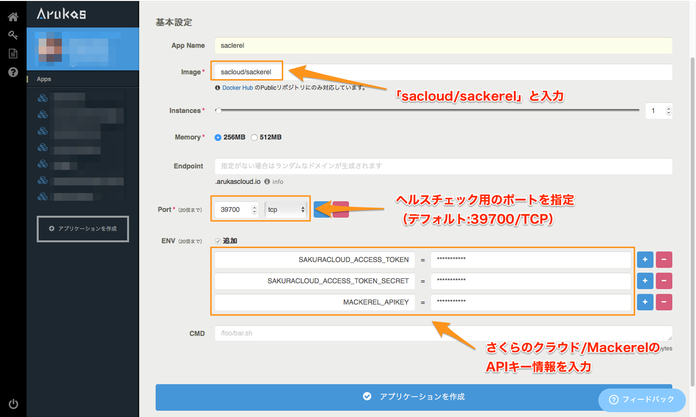

# Sackerel

`sackerel` is integration tool of SakuraCloud and Mackerel.


[](https://godoc.org/github.com/sacloud/sackerel)

## 概要

`sackerel`は[さくらのクラウド](http://cloud.sakura.ad.jp)と[Mackerel](https://mackerel.io/ja/)のインテグレーションツールです。

さくらのクラウド上のサーバーやデータベース、ルーターなどのリソースをMackerelへ連携する事ができます。
`sackerel`を起動しておけば、さくらのクラウド上にリソースを作成/更新するだけで自動でMackerelへ連携されます。

連携のためにMackerelエージェントを各リソースにインストールする必要はありません。

Mackerel上でのホスト/サービス/ロールは自動作成されるため、すぐにMackerelでグラフを見たりアラートの設定を行ったりできます。

## 動作について

`sackerel`はGo言語で書かれた単一バイナリのスタンドアロンアプリです。

起動すると常駐プログラムとして動作し、定期的に以下のジョブを実行します。

#### From さくらのクラウド

  - さくらのクラウドAPIによるリソース情報収集
    - サーバー/ルーター/ロードバランサー/データベース/VPCルーターなどのリソース定義
    - リソースごとの稼働ステータス
    - リソースごとのメトリクス(CPU/Disk/Interfaceなど)
    
#### To Mackerel

  - ホスト/サービス/ロールの登録/更新
  - カスタムグラフ定義
  - メトリクス情報投入

さくらのクラウド上のリソースの種類によって自動でMackerel上にロールが作成されます。

また、あらかじめタグを付けておくことでロールに自動変換することも可能です。
詳細は[便利な機能](#便利な機能)を参照してください。


#### 連携可能なリソース

現在、以下のさくらのクラウド上のリソースに対応しています。

  - [サーバー](http://cloud.sakura.ad.jp/specification/server-disk/)
  - [ルーター+スイッチ](http://cloud-news.sakura.ad.jp/switch/)
  - [ロードバランサーアプライアンス](http://cloud.sakura.ad.jp/specification/load-balancing/#load-balancing-content01)
  - [VPCルーターアプライアンス](http://cloud.sakura.ad.jp/specification/network/#network-content04)
  - [データベースアプライアンス](http://cloud-news.sakura.ad.jp/database/)

収集するメトリクスについては[さくらのクラウド：アクティビティグラフ](http://cloud-news.sakura.ad.jp/activity/)を参照してください。
 
## インストール

[リリースページ](https://github.com/sacloud/sackerel/releases/latest)から各プラットフォーム用のバイナリをダウンロード&展開し、実行権を付与してください。

## 使い方

以下のような実行方法があります。お好きな方法でご利用ください。

  - [実行ファイルをダウンロードして実行]
  - [Dockerで実行]
  - [Dockerホスティング環境で実行]


## 使い方(バイナリをダウンロードする場合)

以下の3つの必須パラメータを指定して起動します。

  - `--token`  : さくらのクラウドAPIトークン
  - `--secret` : さくらのクラウドAPIシークレット
  - `--apikey` : MackerelのAPIキー

```bash
$ sackerel --token "Your Token" --secret "Your Secret" --apikey "Your APIKey"
```    

各値は環境変数で指定する事も可能です。`direnv`などをあわせてご利用いただくと便利です。

```bash
$ export SAKURACLOUD_ACCESS_TOKEN="Your Token"         # さくらのクラウド APIトークン
$ export SAKURACLOUD_ACCESS_TOKEN_SECRET="Your Secret" # さくらのクラウド APIシークレット
$ export MACKEREL_APIKEY="Your APIKey"                 # Mackerel APIキー

# 実行
$ sackerel 
```

終了する場合はキーボードでCtrl+cを押してください。

なお、継続して起動させておきたい場合は後述するDockerを利用する方法やDockerホスティングを利用する方法を検討ください。

## 使い方(Dockerを利用する場合)

実行用にDockerイメージを用意しています。
以下のように実行します。

```bash
# オプションをコマンドラインで渡す場合
$ docker run -d sacloud/sackerel --token "Your Token" --secret "Your Secret" --apikey "Your APIKey"
```

## 使い方(Dockerホスティング環境で実行)

[Arukas](https://arukas.io)などのDockerホスティング環境でも動作します。
例としてArukasで動かす場合、以下のようにパラメータ指定します。



## ヘルスチェックについて

`sackerel`を起動すると、ヘルスチェック用にWebサーバーが起動し、デフォルトでは`39700`ポートでリッスンします。

ヘルスチェック用Webサーバーは`sackerel`が起動中は常に起動しており、アクセスするとステータス`200`、レスポンスとして`OK`という文字列を返します。

`sackerel`自身が起動しているかのチェックにご利用ください。

なお、ポート番号は`--port`オプションにて変更可能です。

また、`--disable-healthcheck`オプションを指定することで、ヘルスチェック用Webサーバーを起動しないようにすることができます。

## 便利な機能

### さくらのクラウド上のタグからMackerelのロールへ自動変換

さくらのクラウド上でリソースにタグをつけておくと、Mackerel上でロールとして登録されます。

サービスやアプリ、役割ごとなどでタグを付けておくと、Mackerel側でロールとしてまとめて管理できるので便利です。

注: 先頭の文字が`@`で始まるタグ(特殊タグ)は連携されません。

### 個別のリソースをMackerelへ連携させたくない場合

さくらのクラウド上で、連携させたくないリソースに対し`@mackerel-ignore`タグを付けておくと連携対象外となります。


## その他オプションなど

指定できるオプションについては`sackerel --help`で表示されるヘルプを参照してください。

各オプション項目の詳細は[Options:オプションについて](docs/Options.md)を参照してください。

```bash
$ sackerel --help
  NAME:
     sackerel - A integration tool of Mackerel and SakuraCloud
  
  USAGE:
     sackerel [options]
  
  REQUIRED PARAMETERS:
     --token value, --sakuracloud-access-token value          API Token of SakuraCloud (default: none) [$SAKURACLOUD_ACCESS_TOKEN]
     --secret value, --sakuracloud-access-token-secret value  API Secret of SakuraCloud (default: none) [$SAKURACLOUD_ACCESS_TOKEN_SECRET]
     --apikey value, --mackerel-apikey value                  API Key of Mackerel (default: none) [$MACKEREL_APIKEY]
     
  OPTIONS:
     --zones value, --sakuracloud-zones value        Target zone list of SakuraCloud (default: "is1b", "tk1a") [$SAKURACLOUD_ZONES]
     --interval value, --timer-job-interval value    Interval of each timer jobs (default: 2m0s) [$SACKEREL_TIMER_JOB_INTERVAL]
     --period value, --metrics-history-period value  Period of collecting metrics history (default: 15m0s) [$SACKEREL_METRICS-HISTORY-PERIOD]
     --port value, --healthcheck-port value          Number of web server port for healthcheck (default: 39700) [$SACKEREL_HEALTHCHECK_PORT]
     --disable-healthcheck                           Flag of disable health check web server (default: false) [$SACKEREL_DISABLE_HEALTHCHECK]
     --skip-init                                     Flag of skip init job (default: false) [$SACKEREL_SKIP_INIT]
     --help, -h                                      show help
     --version, -v                                   print the version
     
  ************* ADVANCED OPTIONS **************
  
     FOR PERFORMANCE TUNING:
        --api-call-interval value           Time duration of API call interval (default: 500ms) [$SACKEREL_API_CALL_INTERVAL]
        --job-queue-size value              Size of internal job queue (default: 50) [$SACKEREL_JOB_QUEUE_SIZE]
        --throttled-api-request-size value  Size of throttledAPI requst queue (default: 0) [$SACKEREL_THROTTLED_API_REQUST_QUEUE_SIZE]
        --sakura-api-queue-size value       Size of SauraAPI request queue (default: 10) [$SACKEREL_SAKURA_API_REQEST_QUEUE_SIZE]
        --mackerel-api-queue-size value     Size of MackerelAPI request queue (default: 10) [$SACKEREL_MACKEREL_API_REQEST_QUEUE_SIZE]
        
     FOR DEBUG:
        --sakuracloud-trace-mode  Flag of SakuraCloud debug-mode (default: false) [$SAKURACLOUD_TRACE_MODE]
        --mackerel-trace-mode     Flag of Mackerel debug-mode (default: false) [$MACKEREL_TRACE_MODE]
        --trace-log               Flag of enable TRACE log (default: false) [$SACKEREL_TRACE_LOG]
        --info-log                Flag of enable INFO log (default: true) [$SACKEREL_INFO_LOG]
        --warn-log                Flag of enable WARN log (default: true) [$SACKEREL_WARN_LOG]
        --error-log               Flag of enable ERROR log (default: true) [$SACKEREL_ERROR_LOG]
        
  *************************************************
  VERSION:
     0.0.1, build xxxxxxxx
  
  Copyright (C) 2016 Kazumichi Yamamoto.
```

## License

  
  `sackerel` Copyright (C) 2016 Kazumichi Yamamoto.

  This project is published under [GPLv3](LICENSE).
  
## Author

  * Kazumichi Yamamoto ([@yamamoto-febc](https://github.com/yamamoto-febc))

